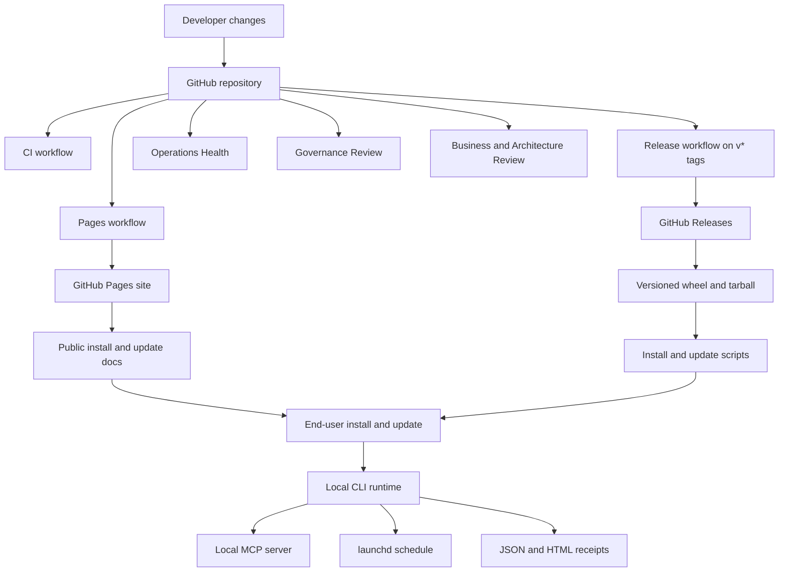

# DreamCleanr Deployment Architecture

## Decision

DreamCleanr is finalized as a `GitHub-first, release-driven, low-maintenance` product.

The deployed product today is:

- a local Python CLI installed from the latest GitHub Release
- a local MCP server for Claude, Codex, and VS Code
- a local `launchd` schedule on the user's Mac
- a public GitHub Pages site
- GitHub Releases for stable downloadable artifacts
- GitHub Actions for CI, Pages, Release, daily health, weekly governance, and monthly business review

DreamCleanr does **not** require a backend, database, user accounts, telemetry service, or native auto-updater in this phase.

## Breadth Of Deployment

### Shipped now

- `dreamcleanr` CLI
- `dreamcleanr-mcp` local server
- local JSON and HTML cleanup receipts
- local `launchd` scheduling
- public GitHub Pages launch site
- GitHub Releases with versioned downloadable artifacts
- daily `Operations Health`
- weekly `Governance Review`
- monthly `Business And Architecture Review`

### Next research lane

- Homebrew publication
- PyPI publication
- marketplace-style client packaging

### Later lane

- native macOS shell
- iPhone and iPad viewer/controller
- native updater economics and distribution costs
- paid Pro and Team layers

## Architecture Flow

## Operator Matrix

| Surface | System of record | Operator | Purpose |
|---|---|---|---|
| Source, roadmap, support | GitHub repo, issues, PRs | Maintainer | Code, docs, backlog, support queue |
| Build and test | GitHub Actions | GitHub runners | CI, packaging, install smoke, release checks |
| Marketing and install site | GitHub Pages | GitHub runners | Public trust and install surface |
| Downloadable artifacts | GitHub Releases | GitHub runners | Wheel, tarball, sample report, install/update scripts |
| Daily health | `ops-health.yml` | GitHub runners | Live site, release links, scripts, sample report |
| Weekly governance | `governance-review.yml` | GitHub runners | Workflow health, issue aging, release freshness, public links |
| Monthly business review | `business-review.yml` | GitHub runners | Download trend, install friction, roadmap drift, monetization readiness |
| Local cleanup runtime | User Mac | End user | Scan, clean, schedule, generate receipts, expose MCP tools |

## Release, Install, And Update Loop

### Source of truth

- `main` is the source of truth for docs, the site, and the install/update scripts
- version tags `v*` are the source of truth for packaged release assets
- GitHub Releases are the canonical artifact surface
- `releases/latest` is the canonical evergreen download/update target

### Build and release loop

1. Changes land on GitHub through normal collaboration.
2. `ci.yml` validates the package, MCP module, tests, and sample report rendering.
3. Pushes to `main` update the GitHub Pages site.
4. A version tag triggers `release.yml`.
5. `release.yml` builds versioned artifacts, generates the sample report, and publishes install/update scripts alongside the release.
6. The `release: published` event triggers install smoke verification.

### Install loop

DreamCleanr supports three official install paths:

1. run the public `install.sh`, which resolves the latest stable wheel from GitHub Releases
2. open `releases/latest` and install from the current published artifacts
3. clone the repository and run `./scripts/bootstrap.sh`

### Update loop

DreamCleanr keeps updates simple and GitHub-native:

1. release a new version tag
2. keep the install and update scripts pointing at the newest stable release
3. update via the public `update.sh`, rerun the installer, or use checkout refresh
4. keep the MCP server entry point stable so local integrations do not need redesign

## GitHub Operations Plane

### Workflows

- `ci.yml`: package and test confidence
- `pages.yml`: deploy the public site
- `pages-verify.yml`: verify the public Pages deployment after Pages succeeds
- `release.yml`: publish versioned release artifacts and install/update scripts
- `install-smoke.yml`: verify release-asset install, public install script, and upgrade path
- `ops-health.yml`: verify the live site, latest asset URLs, scripts, and sample report
- `governance-review.yml`: weekly GitHub hygiene and public-surface review
- `business-review.yml`: monthly business and architecture review

### Public surfaces

- repo: code, issues, docs, release notes
- Pages: install, trust, and launch messaging
- Releases: wheel, tarball, sample report, install/update scripts

## Local Runtime Topology

DreamCleanr runs entirely on the user's Mac:

- CLI commands: `scan`, `clean`, `report`, `schedule`
- local MCP server: preview-first assistant tooling
- local `launchd` LaunchAgent
- local JSON and HTML receipts under `~/Library/Logs/DreamCleanr/reports`

Protected local state remains part of the architecture boundary:

- `~/.codex`
- `~/.claude`
- `~/Library/Application Support/Codex`
- `~/Library/Application Support/Claude`
- Claude VM bundle
- Docker VM backing storage

## Low-Maintenance Operating Model

DreamCleanr stays intentionally cheap to operate:

- GitHub is the only required public control plane
- static hosting only
- no always-on backend
- no user accounts
- no mandatory cloud sync
- no custom update service

## Near-Term Priorities

1. Keep the install and update scripts as the official evergreen channel.
2. Preserve receipt compatibility and MCP stability across releases.
3. Use GitHub review artifacts instead of local operational memory.
4. Research Homebrew and PyPI next, but do not block the current deployment on them.
5. Add native shells only after the GitHub-first product earns the extra maintenance cost.
