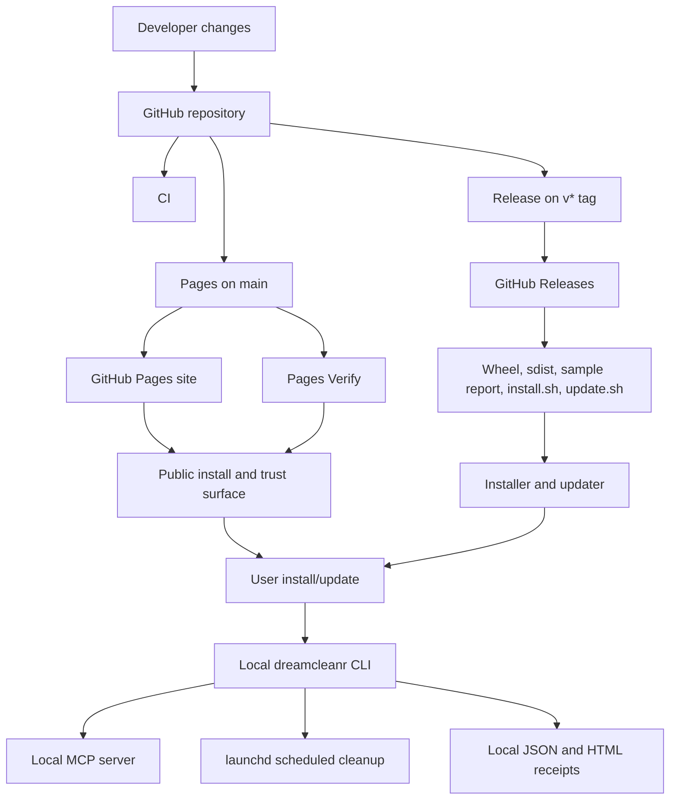
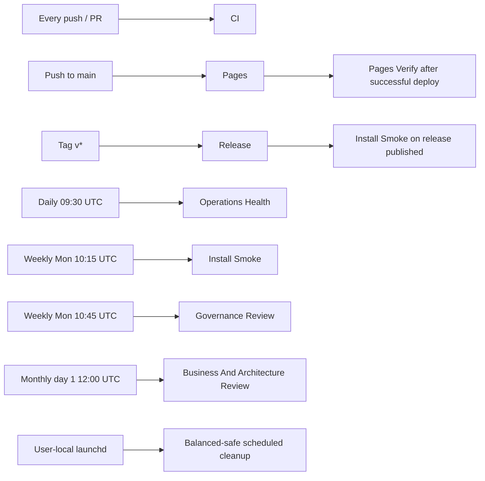

# DreamCleanr Final Deployment Report

## Current Verified State

- Public repo: `https://github.com/jlsport18/DreamCleanr`
- Public site: `https://jlsport18.github.io/DreamCleanr/`
- Latest verified release: `v0.3.2`
- Latest verified wheel asset: `dreamcleanr-0.3.2-py3-none-any.whl`
- Repo state at verification: clean and synced to `origin/main`
- Verified GitHub automation state:
  - `CI`: passing
  - `Pages`: live
  - `Pages Verify`: ready for post-deploy validation
  - `Release`: passing on latest tag
  - `Install Smoke`: passing on `main`
  - `Operations Health`: passing
  - `Governance Review`: passing
  - `Business And Architecture Review`: passing

## Deployed Surfaces

- GitHub repository as the source of truth for code, docs, issues, and release history
- GitHub Releases as the stable artifact surface for versioned wheels, source distributions, sample report output, and the public install/update scripts
- GitHub Pages as the public launch, trust, and install surface
- Local `dreamcleanr` CLI runtime on macOS
- Local `dreamcleanr-mcp` server for Claude, Codex, and VS Code
- Local `launchd` schedule for balanced-safe cleanup and bounded report retention
- Local report output under `~/Library/Logs/DreamCleanr/reports`
- No required backend, database, accounts, or hosted telemetry in the current deployment model

## Release / Install / Update Flow

1. Changes land in the GitHub repo and are validated by `CI`.
2. Pushes to `main` deploy the public site through `Pages`.
3. Version tags `v*` trigger `Release`.
4. `Release` builds the package artifacts, renders the sample cleanup report, and publishes release assets plus `scripts/install.sh` and `scripts/update.sh`.
5. `Install Smoke` verifies the latest wheel install path, the public installer, the upgrade path, and the live public surface.
6. `Pages Verify` confirms the public site is reachable after the Pages deployment completes.
7. End users install through the public installer, the latest GitHub Release, or a local checkout bootstrap.
8. End users update through the public updater, rerunning the installer, or refreshing a local checkout.
9. Local runtime stays preview-first and writes canonical latest JSON and HTML receipts on-device.

## Runtime / Deployment Flow

## Scheduled Automations

### GitHub Actions cadence

- `Operations Health`: daily at `30 9 * * *`
- `Install Smoke`: weekly on Monday at `15 10 * * 1`, plus `release: published`
- `Governance Review`: weekly on Monday at `45 10 * * 1`
- `Business And Architecture Review`: monthly at `0 12 1 * *`
- `Pages`: on push to `main` and manual dispatch
- `Pages Verify`: on successful `Pages` completion and manual dispatch
- `CI`: on push and pull request
- `Release`: on version tags `v*`

### Local cadence

- `dreamcleanr schedule install` creates a user-local `launchd` job
- default local schedule remains balanced-safe and writes canonical latest artifacts to the DreamCleanr reports directory

## Scheduled Automation Cadence

## Operator Ownership

- Repository owner and default code owner: `@jlsport18`
- GitHub repository remains the operational source of truth for docs, releases, backlog, and support intake
- GitHub Actions runners own build, deploy, release, install-smoke, health, governance, and monthly review automation
- DreamCleanr operator skills own strategy refresh, future-commercial incubation, and release-launch execution guidance inside the repo
- End users own local installation, local MCP wiring, local `launchd` scheduling, and receipt review on their own Macs
- DreamCleanr runtime ownership stays split cleanly between GitHub-operated public surfaces and user-operated local execution

## Verification Checklist

- `CI` is green on the target deployment state
- `Pages` is serving the public site successfully from `main`
- latest GitHub Release includes a wheel, source distribution, sample report, `install.sh`, and `update.sh`
- `Install Smoke` passes for latest wheel install, public installer, upgrade path, and public surface checks
- `Operations Health` passes for compile, MCP validation, tests, sample report rendering, site content, release URLs, and install/update script availability
- `Governance Review` is posting or uploading its expected artifacts on schedule
- `Business And Architecture Review` is posting or uploading its expected artifacts on schedule
- local CLI commands still work: `scan`, `clean`, `report`, `schedule`
- local MCP entry point still loads for Claude, Codex, and VS Code integration examples
- local scheduled cleanup remains balanced-safe and continues to protect Claude, Codex, and Docker high-risk state
